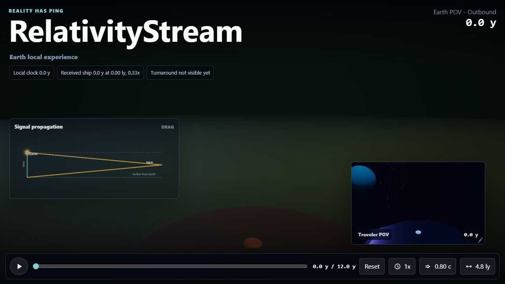

# Full Screen 3D UI Integration

## What changed

- Integrated the `NonIntegratedCode/ThreeDTree.html` prototype direction into the app as a reusable Three.js visual component in `src/ThreeTreeScene.tsx`.
- Replaced the side-by-side stream layout with a full-screen current POV and a movable, resizable picture-in-picture for the other POV.
- Preserved the Earth land theme and traveler space theme in both the main viewport and picture-in-picture.
- Moved signal propagation into a draggable floating overlay with a translucent resting state and opaque hover state.
- Rebuilt the scenario controls as a bottom-docked video-player rail:
  - icon-only play/pause button
  - timeline scrubber
  - collapsed speed, velocity, and turnaround distance controls
  - popovers with sliders and numeric text inputs for precise values
- Removed the Earth reunion, Traveler reunion, and Clock gap strip from the visible control surface.
- Added `three` and `@types/three` as focused dependencies for the 3D renderer.

## Why

The old UI proved the model and signal-delay behavior, but the split-screen SVG presentation no longer matched the desired immersive POV experience. This slice keeps the relativity model intact while making the visual layer cinematic and interaction-first.

## How to run

```powershell
npm run dev
```

Open `http://127.0.0.1:5173`.

Use the bottom rail to play, scrub, reset, and open the compact speed, velocity, and turnaround controls. Click the picture-in-picture without dragging to switch POV. Drag the picture-in-picture to move it, or use the bottom-right handle to resize it. Drag the signal overlay to reposition it.

## Automated checks

```powershell
npm run lint
npm test
npm run build
npm run test:e2e
npm run check
```

Results:

- `npm run lint`: passed
- `npm test`: passed, 19 tests
- `npm run build`: passed
- `npm run test:e2e`: passed, 1 Chromium test
- `npm run check`: passed

The production build emits a Vite warning because the Three.js bundle puts the main chunk over 500 kB. This is expected for the new 3D dependency and can be addressed later with code splitting if needed.

## Browser checks

Browser verification was performed against `http://127.0.0.1:5173` in the Codex in-app browser.

Checked:

- page loads with no console errors
- two WebGL canvases render, one for the full-screen POV and one for picture-in-picture
- Earth POV uses the land scene
- Traveler POV uses the space scene
- play advances the timeline and displayed values
- picture-in-picture click switches POV
- signal overlay is visible and does not cover the bottom controls
- compact control popover appears for speed
- no obvious desktop overflow or broken labels

Screenshot:



## Human review

Please review the subjective visual tone and whether the procedural tree should become more prominent earlier in the default timeline. At `0.0 y` the scene intentionally starts as a seed/sprout; during playback and scrubbing the tree growth becomes clearer.

## Limitations and follow-up

- The Three.js chunk is large enough to trigger Vite's default chunk-size warning.
- The tree animation is integrated as a deterministic 3D scene, but it is not a byte-for-byte port of the standalone HTML prototype.
- Future polish could add richer received-stream color shifting and more explicit signal-rate visual effects in the 3D scene itself.
