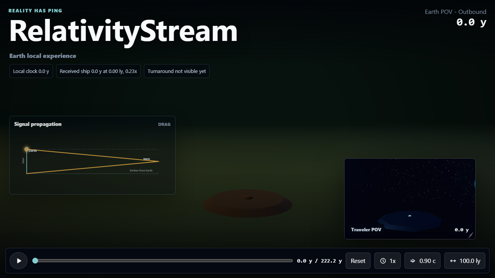
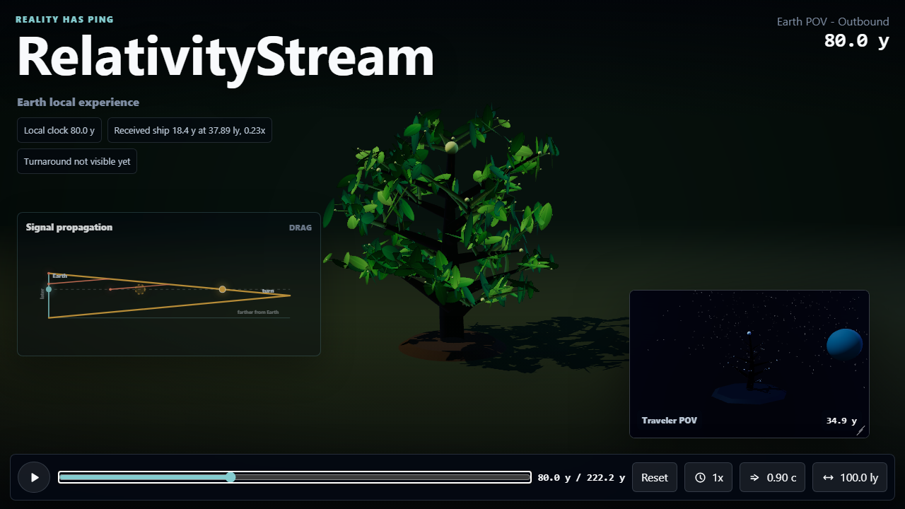

# Prototype Tree Lifecycle And Tunables

## What changed

- Reworked `src/ThreeTreeScene.tsx` to follow the `NonIntegratedCode/ThreeDTree.html` prototype much more closely:
  - tapered curved branch geometry
  - parented branch growth
  - textured leaf planes instead of simple spheres
  - leaf fall, branch wilt, dust buildup, and dust fade
  - multiple tree generations so the lifecycle can loop
- Added `src/tunables.ts` for documented scenario and rendering constants.
- Changed the default scenario to `100 ly` turnaround distance at `0.9 c`.
- Tuned the visual tree-year scale so the default Earth timeline maps to two 75-year tree lifecycles.
- Fixed the tree camera to a stable, zoomed-out framing so the mature tree stays in view instead of zooming during animation.
- Changed numeric popover text inputs so edits are draft-based:
  - sliders still apply immediately
  - text input changes apply on blur or Enter
  - invalid blur resets to the current value
  - Escape reverts and dismisses

## Why

The previous integrated tree was structurally simpler than the standalone prototype. This pass preserves more of the prototype's visual character and lifecycle behavior while keeping the existing relativity model unchanged.

## How to run

```powershell
npm run dev
```

Open `http://127.0.0.1:5173`.

Useful tuning points are in `src/tunables.ts`. The main constants to experiment with are the default velocity/distance, tree lifecycle year mapping, branch/leaf/dust counts, and fixed camera position.

## Automated checks

```powershell
npm run lint
npm test
npm run build
npm run test:e2e
npm run check
```

Results:

- `npm run lint`: passed
- `npm test`: passed, 20 tests
- `npm run build`: passed
- `npm run test:e2e`: passed, 1 Chromium test
- `npm run check`: passed

The Vite bundle-size warning remains because Three.js is bundled into the app.

## Browser checks

Browser verification was performed with Playwright against `http://127.0.0.1:5173`.

Checked:

- page loads without console errors
- default timeline is `0.0 y / 222.2 y`
- default controls show `0.90 c` and `100.0 ly`
- timeline scrub to `80.0 y` shows a mature Earth tree in the fixed camera frame
- Earth scene keeps the land theme
- traveler PIP keeps the space theme
- signal overlay remains visible
- numeric distance entry does not commit until Enter/blur

Screenshots:





## Human review

Please review whether the mature tree density and fixed camera framing match the prototype closely enough. The implementation now copies the prototype structure far more directly, but it is still adapted into React/TypeScript and themed for Earth/traveler views.

## Limitations and follow-up

- The in-app browser screenshot API timed out on the WebGL scene, so screenshots were captured through Playwright instead.
- The renderer still creates both the main POV and PIP scenes independently. That keeps the implementation straightforward, but future optimization may share geometry or lazy-render the PIP.
